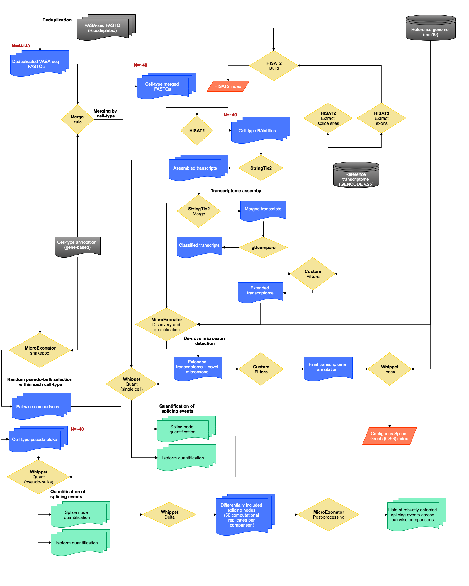

# II. Alternative splicing analyses

To perform a deep characterisation of known and novel alternative splicing events we performed a reference guided transcriptome assemby and splicing quantifiaction inegrating three main computational worflows (StringTie2, MicroExonator and Whippet) and several in-house scripts. Overall desing the data analyses we conducted are represented in the following workflow chart:

**Computational Workflow for alternative splicing analyses**. The flow diagram shows the steps to conduct alternative splicing analyses using VASA-seq data. To expand the transcriptome annotation, we implemented a [Hisat2/StringTie2 based pipeline](a_Transcriptome_assembly/) using Snakemake. This pipeline starts with the deduplication of raw reads using Unique Molecular Identifier (UMI) information. FASTQ files are merged by cell-type and mapped mouse reference genome (mm10) using ``HISAT2``. Resultant alignments for each cell-type are assembled using ``StringTie2`` and subsequently merged into a single GTF file. Assembled transcripts are annotated using ``gtfcompare`` and filtered customised parameters designed to avoid false-positive transcripts. The extended transcriptome is stored as a GTF file, which is used to expand further the annotation of splicing events using [MicroExonator](b_Microexon_annotation/), which is a separate snakemake pipeline designed to discover novel microexons. The final transcriptome annotation is used to quantify alternative splicing events with ``Whippet``through a [dedicated MicroExonator's downstream module](c_AS_quantification). To this end, the final extended transcriptome GTF is processed to generate a Contiguous Splice Graph (CSG) index, which enable all downstream splicing profiling steps. Whippet quantifies alternative splicing events by measuring the inclusion of splicing nodes. We quantified the splice node inclusion and isoform abundance across single-cells and pseudo-bulks. Finally,  we used cell-type annotations to perform pairwise comparisons of splicing profiles, leading to the detection of differentially included splicing nodes. To this end, we ran ``whippet-quant`` across pseudo-bulks randomly sampled from cell types and ``whippet-delta`` to assess differential inclusion of splicing nodes. This MicroExonator's module runs `Whippet` over multiple groups of randomly generated cell-type pseudo-bulks to avoid spurious results due to random arrangements of pseudo-bulks. The results from these computational replicates are post-processed to provide a list of splicing nodes that were robustly detected as differentially included across pairwise comparisons. 

